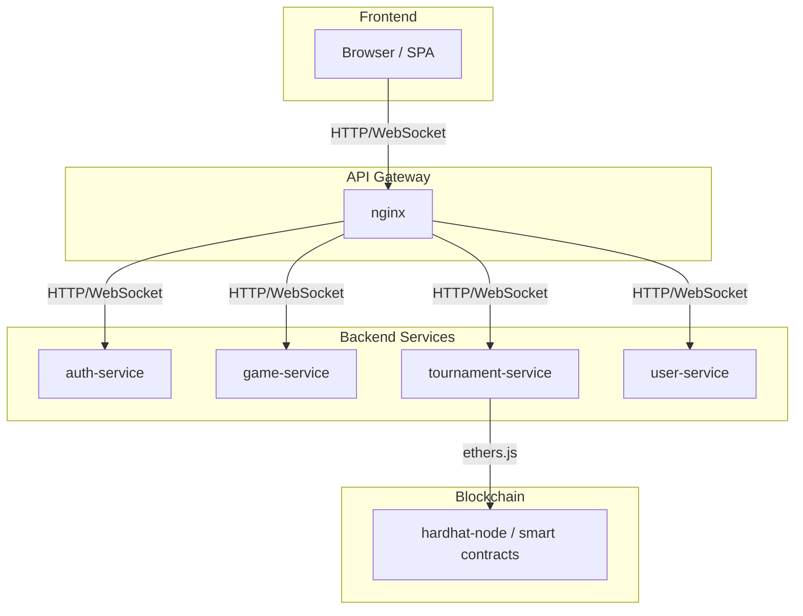

# System Architecture: Frontend & Backend Connections

## Diagram: Service Connections

## Detailed Explanation

### 1. Frontend (SPA)
- Runs in the browser, built with TypeScript and Vite.
- Uses SPA routing for seamless navigation.
- Communicates with backend via HTTP (REST API) and WebSocket (real-time updates).
- Handles user interactions, game rendering, and UI updates.

### 2. API Gateway (nginx)
- Acts as a reverse proxy for all frontend requests.
- Routes HTTP and WebSocket traffic to the correct backend service based on URL path.
- Provides load balancing, security (CORS), and static file serving.

### 3. Backend Microservices
- **auth-service**: Handles authentication, registration, login, JWT issuance.
- **game-service**: Manages real-time Pong matches, game state, and WebSocket connections for gameplay.
- **tournament-service**: Organizes tournaments, brackets, and communicates with blockchain for result recording.
- **user-service**: Manages user profiles, achievements, statistics, and friend relationships.
- Each service runs independently, exposes REST and/or WebSocket endpoints, and uses its own SQLite database.

### 4. Blockchain (hardhat-node)
- Local Ethereum node for development/testing.
- Tournament results are recorded on-chain via smart contracts.
- Backend (tournament-service) interacts with blockchain using ethers.js.

## Principles of Operation

- **Microservices Architecture**: Each backend service is responsible for a specific domain, allowing independent development, scaling, and deployment.
- **API Gateway**: Centralizes routing, security, and traffic management, simplifying frontend-backend communication.
- **SPA Frontend**: Provides fast, dynamic user experience by updating views without full page reloads, and synchronizes game state in real time.
- **WebSocket Communication**: Enables low-latency, bidirectional data flow for gameplay and live updates.
- **Blockchain Integration**: Ensures transparency and immutability for tournament results.
- **Authentication**: JWT tokens are used for secure, stateless user sessions across services.
- **Database Isolation**: Each service manages its own data, reducing coupling and improving reliability.

## Example Flow
1. User accesses SPA in browser (served by nginx).
2. SPA requests login via auth-service (HTTP).
3. Upon login, JWT is issued and used for authenticated requests.
4. User joins a game; SPA opens WebSocket to game-service for real-time play.
5. User enters a tournament; SPA interacts with tournament-service, which records results on blockchain.
6. User profile, stats, and achievements are managed via user-service.

---

This architecture ensures scalability, maintainability, and a responsive user experience for multiplayer Pong gameplay and tournament management.
